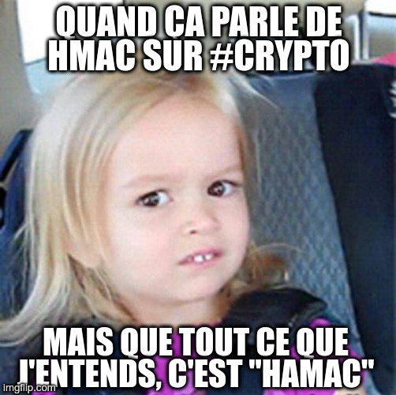

# Énoncé 

Connaissez-vous l'existence de rockyou ?

# Solution

Pour résoudre ce challenge, il va falloir faire une attaque par force brute pour trouver le mot de passe utilisé pour chiffrer le flag. L'énoncé suggère que l'on peut utiliser le dictionnaire rockyou.txt, que l'on peut trouver préinstallé sur certaines distributions comme Kali Linux ou que vous pouvez télécharger ici : https://github.com/praetorian-inc/Hob0Rules/blob/master/wordlists/rockyou.txt.gz

C'est un peu la wordlist "de base / de départ" utilisée dans la communauté de la cybersécurité, qu'on utilise pour faire des attaques par dictionnaire en CTF ou dans la vraie vie pour du pentest par exemple. Vous la rencontrerez sûrement à bien d'autres occasions ! L'idée de ce challenge semble justement de vous y familiariser.

Bref, pour effectuer ce bruteforce, voir le solve.py associé.
Au bout d'un temps on voit que le mot de passe utilisé pour chiffrer le flag est `omgh4xx0r`.

Et on récupère surtout le flag en clair !
Flag : FCSC{5bb0780f8af31f69b4eccf18870f493628f135045add3036f35a4e3a423976d6}