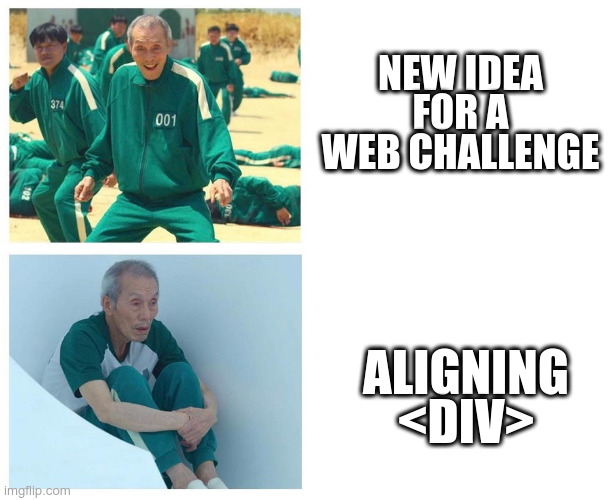

# Énoncé 
Pour cette épreuve, vous devrez vous pencher sur une fonctionnalité essentielle du protocole HTTP.



https://header.france-cybersecurity-challenge.fr/


# Code source de l'application web

Ce code est donné directement sur le lien du challenge affiché ci-dessus, je vous l'inclus ici au cas où il ne serait plus disponible :

```
const fs = require('fs');
const express = require('express');
const escape = require('escape-html')
var favicon = require('serve-favicon');
const app = express();

app.use(favicon('favicon.ico'));
app.set('view engine', 'ejs');
app.use(express.static('public'));

app.get('/', async (req, res) => {
    var verif = req.header("X-FCSC-2022");
    if (verif == "Can I get a flag, please?") {
        var flag = fs.readFileSync("flag.txt");
        res.status(200);
        res.render("pages/index", {
            type: "success",
            msg: "Here it is: " + flag,
        });
        return res.end();
    } else {
        res.status(200);
        res.render("pages/index", {
            type: "warning",
            msg: "No flag for you. Want a meme instead?",
        });
        return res.end();
    }
});

app.get('/source', async (req, res) => {
    const source = fs.readFileSync(__filename);
    res.render("pages/source", {
        source: escape(source),
    });
    return res.end();
});

app.listen(2150);
```


# Solution

Il suffit d'envoyer un header HTTP ayant la nom "X-FCSC-2022" et ayant comme valeur associée "Can I get a flag, please?".
Pour cela, on peut utiliser l'outil curl de la manière suivante :

`curl --header "X-FCSC-2022: Can I get a flag, please?" https://header.france-cybersecurity-challenge.fr/`

Flag: FCSC{9ec57a4a72617c4812002726750749dd193d5fbbfeef54a27a9b536f00d89dfb}