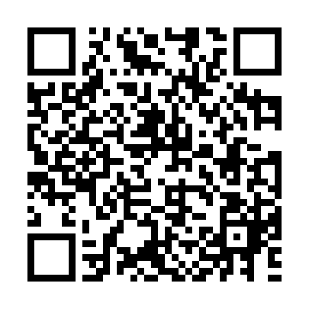

# Énoncé 

Nous avons récupéré ce QRcode que nous n'arrivons pas à lire : pouvez-vous nous aider ?

# Solution

Un scanneur de QR code ne sera pas capable de se "repérer" dans un QR Code et de décoder correctement toutes les données s'il n'a pas les points repères étant les carrés noirs remplis que l'on trouve dans les coins supérieurs gauche et droit, et le coin inférieur gauche.

Voici ce que ça donne sur un exemple de QR code :

Or, sur celui qui nous est fourni, on voit bien qu'il y a une anomalie car ces 3 carrés sont justes "blancs" à l'intérieur, au lieu de contenir des carrés noirs remplis à l'intérieur.

Il suffit donc de restaurer ce QR code de cette manière :

Pour cela, vous pouvez utiliser un outil comme... Paint ! Rien que ça.
Ceci étant fait, on est bien capable de lire le QR Code contenant le flag.

Flag: FCSC{0eea6160d40720fe795adfad6371d78b074dac9c234bfd94f6a94c0c72702a2f}